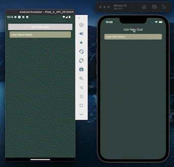
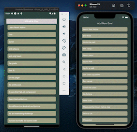
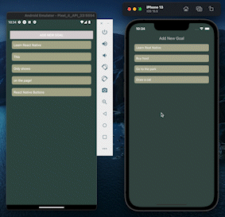

# Simple Goal App using React Native

## The Practical Guide - React Native by Maximilian Schwartzmueller

This app allows you to add goals to a list by utilizing the React Native components like FlatList, Modal, Button, TextInput, View, and Stylesheet.

## Screenshots

Add goals.

Scroll function using FlatList

Delete function with styling to Android and iOS

